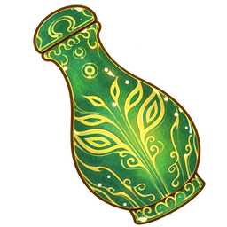

<p align="center">
  
</p>

<h1 align="center">凡人修仙传桌宠</h1>

<p align="center">让 Codex 生成的宠物独立展示在 Windows 桌面。</p>

一款基于《凡人修仙传》角色制作的 Windows 桌面宠物播放器。选择角色后，它会在桌面播放动画、跟随鼠标视线，并在待机、拖动和单击时显示对应对话。应用在本地运行，无需账号或在线服务。

## 项目由来

这个项目起于 Codex 的宠物体系：希望把通过 Codex 生成的宠物独立出来，在不打开 Codex 的时候，也能作为桌面宠物展示和互动。因此做了这个本地播放器，沿用 Codex Pet v2 的宠物包格式，并加入角色切换、对话编辑、托盘管理和位置记忆等功能。当前内置角色以《凡人修仙传》为主题。

## 功能

- **角色切换**：在宠物列表预览角色，一键设为桌宠；管理页支持深色和浅色主题。
- **桌面互动**：待机动画、鼠标视线跟随、单击触摸、拖动和位置记忆。
- **独立对话**：每只宠物分别保存待机、拖拽和触摸台词；可调整随机间隔、气泡停留时间，并按分组恢复默认。
- **托盘常驻**：显示或隐藏宠物、打开管理界面、退出应用；正式版可设置开机后静默启动至托盘。
- **本地宠物包**：从目录读取角色资源。新增内置宠物无需维护额外的角色名单。

## 下载与使用

在仓库的 **Releases** 页面下载 Windows 安装包 `凡人修仙传桌宠_<版本>_x64-setup.exe` 并运行。首次启动会打开宠物管理界面，默认选择宋玉；随机对话的默认间隔为 10–20 秒。

在“宠物”页面悬停卡片可直接点击“设为桌宠”，点击角色图片可打开详情并编辑配置。更改对话、对话间隔、气泡时长或缩放后，点击“保存配置”。

| 操作 | 效果 |
| --- | --- |
| 单击桌宠 | 播放触摸动作并显示触摸对话 |
| 拖动桌宠 | 移动窗口，触发拖拽对话；松开后记住位置 |
| 在桌宠附近移动鼠标 | 视线跟随鼠标 |
| 双击托盘图标 | 打开宠物管理界面 |
| 右键托盘图标 | 显示或隐藏宠物、设置开机自启、打开管理界面或退出 |

关闭管理窗口只会隐藏到托盘。要完全结束程序，请在托盘菜单选择“退出”。从开机自启进入系统时，应用只在托盘运行，不自动打开管理窗口或显示宠物。

## 从源码运行

建议使用 Node.js 22（与发布工作流一致），并安装 npm、Rust 工具链及当前系统所需的 Tauri 2 原生构建环境。Windows 桌宠功能请在 Windows 上运行；浏览器预览主要用于查看和调试前端界面，不提供原生托盘、开机自启或全局鼠标能力。

```powershell
npm ci
npm run tauri:dev  # 启动完整桌面应用
```

其他常用命令：

```powershell
npm run dev          # 浏览器预览：http://127.0.0.1:1420
npm test             # 前端测试
npm run build        # 前端生产构建
npm run tauri:build  # 为当前系统构建安装包并整理发布文件
```

打包结果位于 `release/<版本>/<操作系统>/`。目前 GitHub Actions 的发布流程构建 Windows NSIS 安装包；其他系统的打包脚本已有对应产物目录，但桌宠交互和发布流程尚未按这些系统完成验证。

## 添加宠物

使用者可在应用“设置”页面点击“打开目录”，将宠物文件夹放入该目录，然后**完全退出并重新启动**应用。仓库维护者可将新宠物放在 `pets/<id>/`；内置宠物会在构建时自动发现。

```text
pets/<id>/
├── pet.json
├── spritesheet.webp
└── dialogues.json      # 可选
```

目录名必须与 `pet.json` 的 `id` 相同，ID 使用小写 kebab-case。`spritesheetPath` 应指向该目录内实际存在的 WebP 图集，`spriteVersionNumber` 为 `2`。图集采用 1536×2288、8 列×11 行的布局。`dialogues.json` 的格式与初始化规则见 [对话配置说明](docs/dialogues-json.md)。

仓库内宠物的 `preview.webp` 会在 `npm run dev` 或 `npm run build` 前从图集第一帧自动生成或更新；也可运行 `npm run generate:pet-previews` 单独刷新。管理页使用小预览图，播放动画时才加载完整图集。

内置宠物在应用数据目录中带有 `.fanren-built-in` 标记，由应用维护；请勿手工更改该标记。

## 项目结构

```text
pets/             内置宠物包
src/              React 界面、桌宠动画及浏览器预览
src-tauri/        Rust 后端、窗口、托盘与本地数据
docs/             宠物与对话格式说明
scripts/          预览图生成、版本和打包脚本
release-notes/    GitHub Release 的版本说明
```

Windows 用户数据目录为 `%APPDATA%\fanren-desktop-pet`，其中 `player-state.json` 保存核心用户状态，`pets/` 保存宠物副本。宠物首次导入时会读取包内默认对话；之后编辑内容以状态文件为准。更新 `dialogues.json` 后，已有用户需在对应角色的设置中对所需分组点击“恢复默认”，才能载入新台词。

## 授权说明

本项目原创代码采用 [MIT 许可证](LICENSE)。角色形象、名称、台词、图集和应用图标可能涉及第三方权益，不因代码采用 MIT 许可证而获得授权；使用或再分发这些素材前，请确认相应权利。
